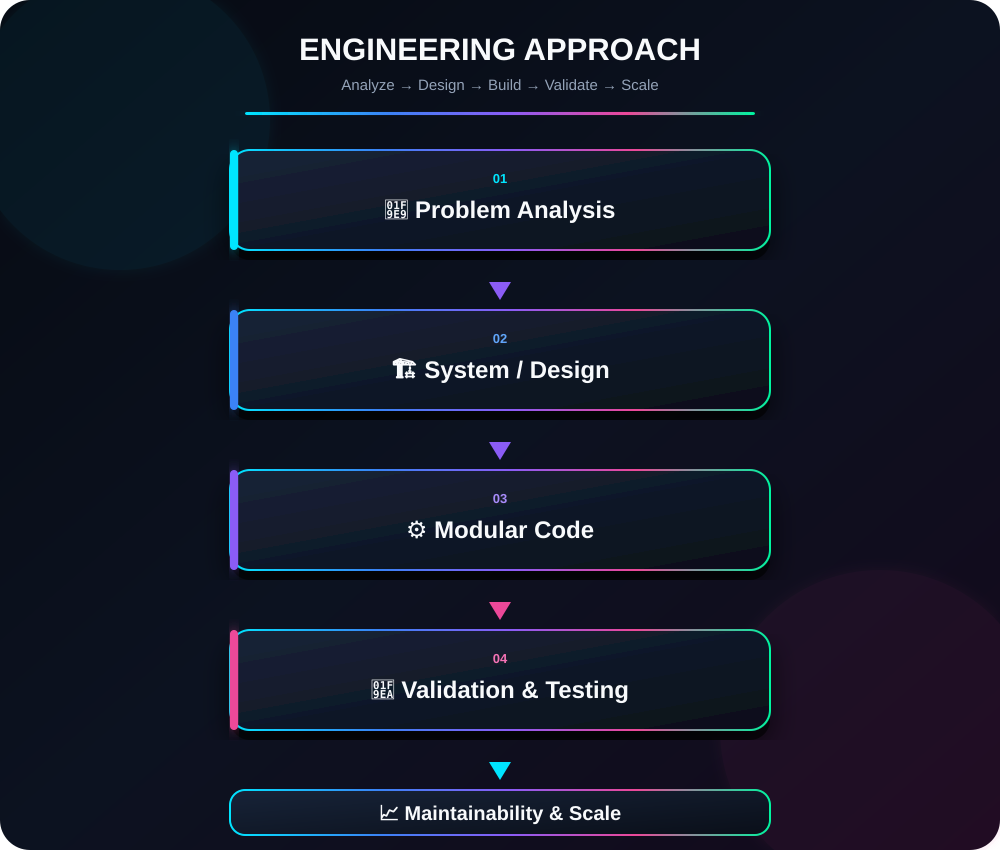
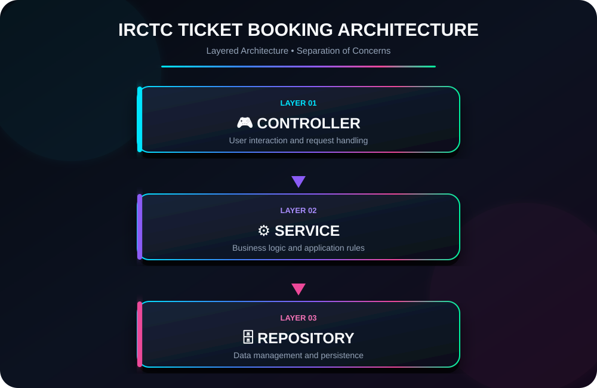
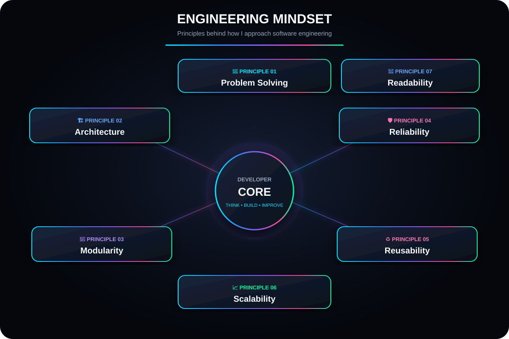

<div align="center">


<br>


<br><br>

<a href="https://linkedin.com/in/pranaw-juyal">

</a>
&nbsp;
<a href="mailto:juyal.pranaw@gmail.com">

</a>
&nbsp;
<a href="https://github.com/Pranaw-dev">

</a>

<br>

</div>

---

# 👨‍💻 About Me

```text
Name        : Pranaw Juyal
Role        : Software Developer
Focus       : Java Backend Development
Location    : India
Education   : B.Tech in Computer Science & Engineering
CGPA        : 8.47 / 10
```

I'm a Software Developer with strong foundations in **Java, Object-Oriented Programming, SQL, Data Structures & Algorithms, and backend application development**.

I enjoy designing software that is **modular, maintainable, reusable, and easy to extend**.

Currently, I'm expanding my backend development expertise with:

* 🌱 Spring Boot
* 🔗 REST API development
* 🗄️ JDBC and MySQL
* 🏗️ Layered and MVC architecture
* 🧠 Data Structures & Algorithms
* ⚙️ Backend system design

> **My goal:** Build real software, understand how it works under the hood, and keep getting better at engineering it.

---

# ⚙️ Technical Skills

## 💻 Languages

<p align="left">
  
  &nbsp;&nbsp;
  
</p>

**Java · SQL**

## 🚀 Backend Technologies

<p align="left">
  
</p>

**Core Java · Spring Boot · REST APIs · JDBC**

## 🧠 Core Concepts

`Object-Oriented Programming` · `Collections Framework` · `Exception Handling` · `CRUD Operations`

`Layered Architecture` · `MVC Architecture` · `Data Structures & Algorithms` · `Modular Design`

## 🗄️ Database

<p align="left">
  
</p>

**MySQL · SQL**

## 🛠️ Tools & Version Control

<p align="left">
  
</p>

**Git · GitHub · Maven · IntelliJ IDEA · VS Code**

---

# 🏗️ Engineering Approach

I believe good software is not just software that works.

It should be **understandable, maintainable, modular, and reliable**.

<div align="center">



</div>

### My priorities

**Readable Code → Good Design → Separation of Concerns → Reusability → Reliability**

---

# 🚆 Featured Project

## IRCTC Ticket Booking System

A modular railway ticket booking system developed using **Core Java and Object-Oriented Programming principles**.

### ✨ Features

* 👤 User registration
* 🔐 User authentication
* 🎫 Ticket booking
* ❌ Ticket cancellation
* 📜 Booking history
* 🗂️ Record management
* ✅ Input validation
* ⚠️ Exception handling

### 🔥 Engineering Highlights

* Implemented **5+ functional modules**
* Applied **Object-Oriented Programming principles**
* Used **ArrayList and HashMap** for in-memory data management
* Separated business logic and data management
* Applied a layered approach inspired by **Controller → Service → Repository**
* Designed the application for future integration with **Spring Boot, REST APIs, and database persistence**

<h3>🏛️ Architecture</h3>

<p>
  The project follows a layered architecture that separates
  user interaction, business logic, and data management.
</p>

<div align="center">



</div>

### 🧰 Tech Stack

`Java` `OOP` `Collections` `Exception Handling` `Layered Architecture`

<br>

<a href="https://github.com/Pranaw-dev?tab=repositories">

</a>

---

---

# 🧩 Currently Building

```text
Backend Development
│
├── ☕ Java
├── 🌱 Spring Boot
├── 🔗 REST APIs
├── 🗄️ JDBC
├── 🐬 MySQL
└── 🏗️ Layered Architecture
```

### Current Focus

* 🔨 Building more real-world backend applications
* 🌱 Deepening Spring Boot expertise
* 🔗 Designing and consuming REST APIs
* 🗄️ Improving SQL and database skills
* 🧠 Strengthening Data Structures & Algorithms
* 🏗️ Learning better architecture and scalable backend design

---

# 🏆 Certifications & Learning

* 🤖 **be10x AI Tools & ChatGPT Workshop**
* 🛰️ **IIRS Outreach Programme – Application of AI/ML Model for Specific Crop Acreage Mapping**
* 🌍 **ISRO–IIRS Geospatial Technology Certification**
* 🛰️ **NASA ARSET Micro-course – Using Spatial Data for Biodiversity**
* 🎤 **TCS iON Career Edge – Presentation Skills**

---

# 🎓 Education

### Bachelor of Technology — Computer Science & Engineering

📅 **2025**
📊 **CGPA: 8.47 / 10**

🏅 Ranked among the **Top 3 students in the CSE batch during the 6th and 7th semesters**

---
<h2>💡 Engineering Mindset</h2>

<p>
  The principles I try to bring into every project:
  <b>think clearly, design intentionally, build modularly, and improve continuously.</b>
</p>

<div align="center">



</div>

---

# 🤝 Let's Connect

I'm interested in:

**Software Development · Backend Engineering · Open Source · Collaborative Projects · Continuous Learning**

<div align="center">

<a href="https://linkedin.com/in/pranaw-juyal">

</a>

 

<a href="mailto:juyal.pranaw@gmail.com">

</a>

<br><br>

### ⚡ Build. Learn. Improve. Repeat.

<br>


</div>
